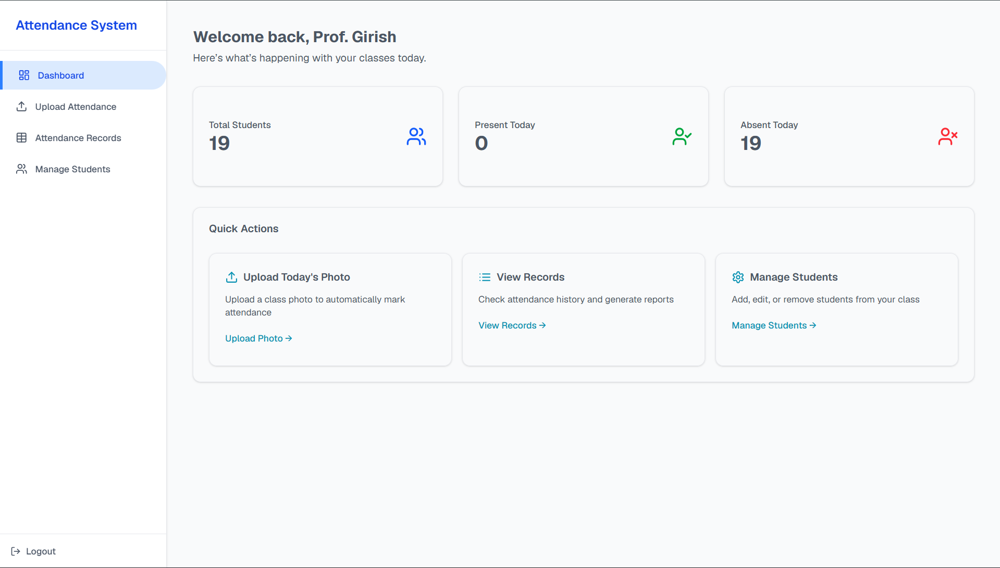
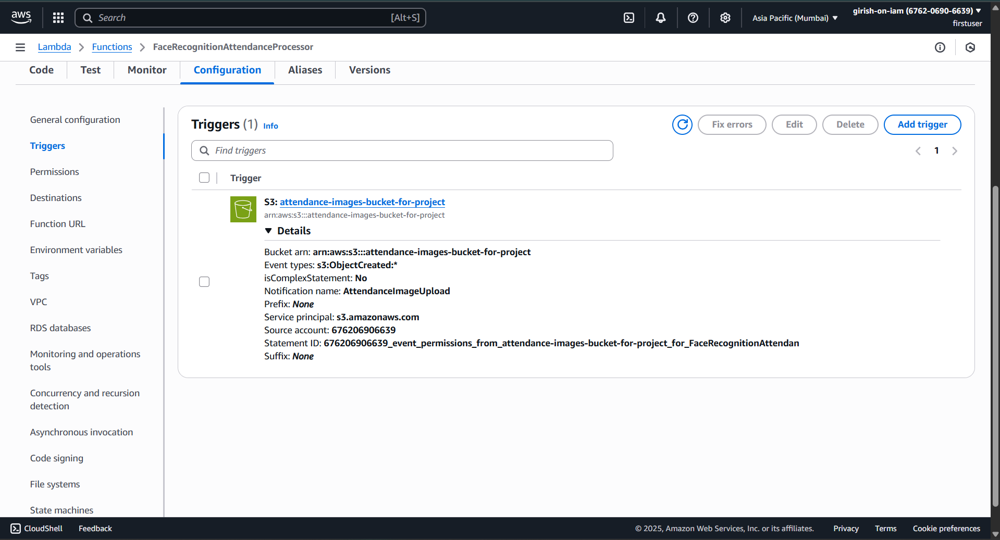
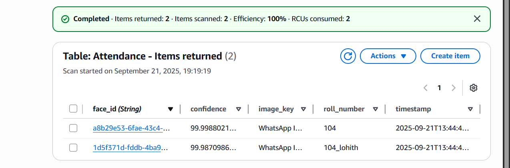

# Cloud-Based Face Recognition Attendance System

An automated, event-driven attendance tracking system built with a serverless AWS backend and a Next.js frontend. This project modernizes traditional roll calls by leveraging cloud-native AI to detect, identify, and log student attendance in real-time from uploaded classroom photos.




> **⚠️ Live Demo Notice:** The AWS backend infrastructure (Rekognition, Lambda, DynamoDB, S3) for this project has been spun down following strict cloud security and FinOps best practices to prevent unauthorized usage and billing charges. The code provided in this repository represents the complete, working system and can be easily redeployed to any AWS environment. 

## 🌟 Overview & Key Features

This system is designed for high scalability and zero infrastructure management, utilizing a fully serverless architecture.

* **Professor Dashboard**: A clean, intuitive Next.js UI showing daily attendance metrics.
* **Event-Driven Automation**: Uploading a photo to S3 automatically triggers the recognition pipeline without manual intervention.
* **Cloud-Native AI**: Powered by Amazon Rekognition, specifically trained/indexed on a custom student facial dataset to differentiate enrolled students from unknown individuals.
* **Real-Time Database**: Instantaneous attendance logging into a NoSQL DynamoDB table.

---

## 🛠️ Tech Stack & Cloud Infrastructure

### Frontend
* **Framework**: Next.js / React (TypeScript)
* **Hosting**: Vercel (`professor-dashboard-wheat.vercel.app`)

### AWS Cloud Backend
* **Compute**: AWS Lambda (Python 3.x, Boto3)
* **AI/Computer Vision**: Amazon Rekognition (`attendance_faces` collection)
* **Storage**: Amazon S3 (`image-bucket-for-project`, `attendance-images-bucket-for-project`)
* **Database**: Amazon DynamoDB (`Attendance` and `Students` tables)
* **Security**: IAM Roles & Custom Policies (Least Privilege architecture)

---

## 🏗️ Cloud Architecture & Workflow

The system relies on an asynchronous, event-driven workflow to handle processing efficiently:

1. **Image Upload**: A professor uploads a classroom picture via the web dashboard directly into the `attendance-images-bucket-for-project` S3 bucket.
2. **Event Trigger**: An `s3:ObjectCreated:*` event fires, immediately invoking the `FaceRecognitionAttendanceProcessor` Lambda function.

**S3 Event Trigger Configuration:**



3. **Facial Analysis**: The Lambda function calls Rekognition's `SearchFacesByImage` API to analyze the image against the pre-indexed `attendance_faces` collection, filtering out unknown faces.
4. **Data Logging**: Successful matches (with their respective confidence scores) are written directly to DynamoDB.

**Real-Time DynamoDB Logging:**



---

## 💻 Core Lambda Processing Logic

The heart of the system is the Python Lambda function that orchestrates the S3 events, Rekognition API, and DynamoDB writes.

```python
import boto3
import os
import urllib.parse
from datetime import datetime

REGION = "ap-south-1"
rekognition = boto3.client('rekognition', region_name=REGION)
dynamodb = boto3.resource('dynamodb', region_name=REGION)
table = dynamodb.Table(os.environ['DYNAMODB_TABLE'])

def lambda_handler(event, context):
    for record in event['Records']:
        bucket_name = record['s3']['bucket']['name']
        object_key = urllib.parse.unquote_plus(record['s3']['object']['key'])
        
        # Call Rekognition to match faces against the indexed collection
        response = rekognition.search_faces_by_image(
            CollectionId=os.environ['REKOGNITION_COLLECTION_ID'],
            Image={'S3Object': {'Bucket': bucket_name, 'Name': object_key}},
            FaceMatchThreshold=50,
            MaxFaces=10
        )
        
        if not response.get('FaceMatches'):
            continue 

        # Process matches and log to DynamoDB
        for match in response['FaceMatches']:
            face = match['Face']
            table.put_item(
                Item={
                    'face_id': face['FaceId'],
                    'roll_number': face['ExternalImageId'],
                    'timestamp': datetime.utcnow().isoformat(),
                    'image_key': object_key,
                    'confidence': f"{match['Similarity']:.2f}"
                }
            )
            
    return {"statusCode": 200, "body": "Success"}

```

---

## 🚀 Local Development Setup

To run the Next.js professor dashboard locally:

### Prerequisites

* Node.js (v18+)
* AWS CLI configured with appropriate IAM credentials
* A `.env.local` file with your AWS access keys, S3 bucket names, and region setup for frontend SDK access.

### Installation

1. Clone the repository:

```bash
git clone https://github.com/Lohith022/professor-dashboard.git
cd professor-dashboard

```

2. Install dependencies:

```bash
npm install

```

3. Start the development server:

```bash
npm run dev

```

---

## 👥 Project Team

Developed by B.Tech AIML students at Woxsen University:

* **Brijesh Naidu**
* **Boggula Lohith**
* **Janapala Sai Girish**
* **Pothuri Indraneel**

**Supervised by:** Dr. Resham Raj Shiwanshi
